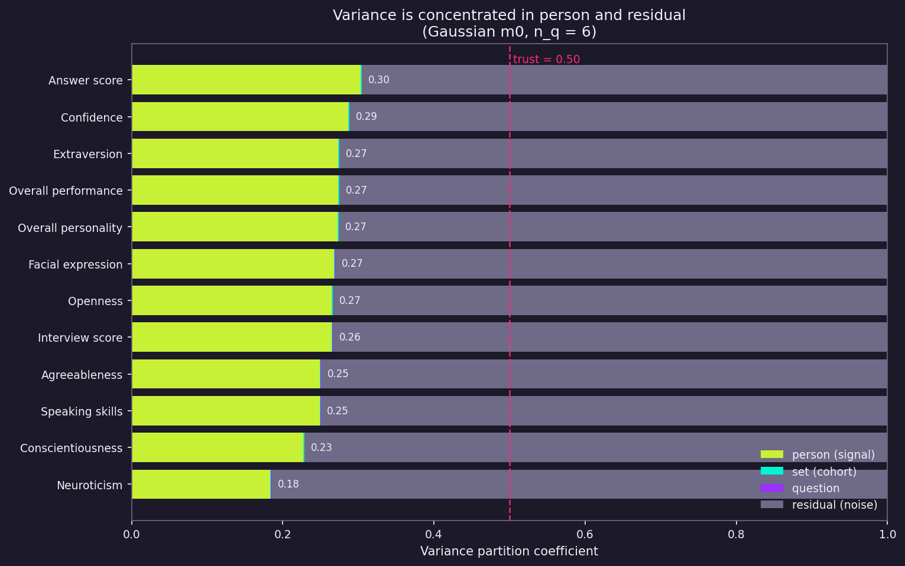
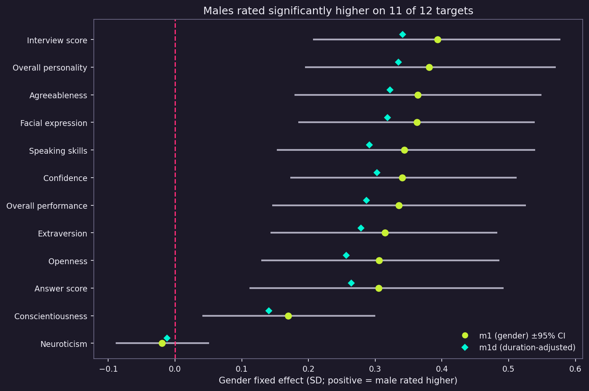

# Gender Bias in AI Scoring of Video Interviews

**Before you can audit an AI for bias, you have to audit the data you're auditing against.**

This is a four-stage study on gender bias in LLM-based video interview scoring. An LLM scores candidates from transcripts; those scores get compared to expert human ratings and tested for differential treatment by gender. Stage 1 — done — establishes the human baseline and checks whether it can be trusted. Stages 2–4 build and audit the LLM.

---

## What I do

I build measurement frameworks for AI systems that score people. My background is psychometrics — the science of whether assessments actually measure what they claim to. I apply that to AI scoring pipelines: does the system measure what it claims to, and can you trust the output?
→ [olgamaslenkova@gmail.com](mailto:olgamaslenkova@gmail.com) 

-----

## Study design

| Stage | Question | Status |
|---|---|---|
| **Stage 1: Human baseline** | Are human ratings reliable? How do they differ by gender? | **Done** |
| Stage 2: LLM scoring | Does an LLM agree with humans, and where do they diverge? | Next |
| Stage 3: Group bias | Do AI–human differences vary by gender? Which questions drive it? | Planned |
| Stage 4: Counterfactual | Is the gap causal? Can it be corrected? | Planned |

---

## Stage 1: what we found

Companies use AI tools to score video interviews, rating candidates on personality traits and communication. When they audit for bias, they compare AI scores to expert human ratings. Standard practice treats those human ratings as the ground truth.

Stage 1 asks: is that ground truth reliable — and is it neutral?

**It isn't.** In the data studied here — 2,011 interview responses rated by clinical psychologists — three-quarters of each score is noise, not stable signal about the person. Even averaging six responses per candidate reaches only borderline reliability. No target is consistent enough to trust as a person-level benchmark.

On top of that, the human ratings already score men higher than women on **11 of 12 measures**, by 0.17–0.39 SD. That direction contradicts what personality research predicts (women score higher on agreeableness and neuroticism in self-report data worldwide). The pattern looks more like a perceived-performance halo than a measure of actual traits.

This means any LLM fairness audit that uses these ratings as ground truth is comparing against a skewed ruler. Stage 1 quantifies exactly how skewed — so Stage 2 can treat the human and LLM scores as two fallible methods side by side, not as truth vs. test.

**Under the EU AI Act**, hiring AI is classified as high-risk and requires fairness auditing. You cannot run a meaningful audit against a benchmark that is itself noisy and biased. You have to measure the ruler first.

---

## Stage 1 results

We reframe Generalizability Theory as a ladder of Bayesian crossed-random-effects models:
`(1 | user_no) + (1 | set_id) + (1 | set_id:question_id)`
fitted per target and decomposed into person, set, question, and residual variance. Reliability coefficients then drive a trust / marginal / do-not-trust classification per target.

| What was measured | Result |
|---|---|
| Person signal in a single clip (VPC_person) | 0.18 – 0.30 across all 12 targets |
| Person-aggregate reliability (Eρ², 6 questions) | 0.57 – 0.72 |
| Targets reliable enough to trust (VPC_person ≥ .50) | **0 of 12** |
| Best target | `answer_score` — *marginal* (Eρ² = 0.72) |
| Does the verdict change if you handle outliers differently? | No — the upper bound never crosses 0.50 |
| Gender gap in the human ratings | men scored higher on **11 of 12** targets, by 0.17 – 0.39 SD |


**Key findings**

- **Variance is almost entirely person + residual.** Set and question components are negligible. Question variance is near-zero by construction (scores derive from within-question pairwise comparisons).
- **No target reaches "trust."** 11 of 12 are do-not-trust; only `answer_score` is marginal. This holds regardless of how the heavy tails (excess kurtosis 9–13 on most targets) are treated.
- **Answer duration carries genuine person signal** — verbose candidates are consistently rated higher; length is partly a trait expression, not measurement noise.
- **Gender:** the ratings score men higher on 11/12 targets (0.17–0.39 SD, credible intervals exclude zero); neuroticism null. This direction is inconsistent with established self-report Big Five sex differences (women score higher on agreeableness and neuroticism; Schmitt et al., 2008), pointing to perceived-performance variance rather than latent traits. Duration mediates only ~12–16% of the gap.



*Variance splits almost entirely between person (signal) and residual (~75%). No target approaches the 0.50 trust threshold (dashed line).*



*Model-based gender fixed effect (male relative to female). The ratings favour men on 11 of 12 targets — opposite to the female-higher direction expected for agreeableness and neuroticism from self-report norms.*

One constraint bounds every number: only the derived scores are available (no raw pairwise data, no rater identifiers). Person×question is confounded with the residual, so VPC_person is a lower bound on signal and inter-rater reliability cannot be estimated here.

Full report: [`Report_Stage1_human_baseline.md`](Report_Stage1_human_baseline.md)

### Data access

This repository does **not** redistribute RecruitView, which is **gated** and licensed **CC BY-NC 4.0** (academic / non-commercial use only).

1. Request access at [huggingface.co/datasets/AI4A-lab/RecruitView](https://huggingface.co/datasets/AI4A-lab/RecruitView) and agree to the Responsible AI Usage Policy.
2. Run `python src/prepare_full_dataset.py` to rebuild `data/recruitview_full.csv` locally.


---

## Methodology

**Dataset.** RecruitView — 2,011 single-question video-interview responses from 331 participants across 76 questions (15 reconstructed question sets). Each response carries 12 continuous target scores: the Big Five personality traits plus an overall personality index, and six interview-performance metrics. Clinical psychologists made ≈27,000 pairwise comparisons that were converted to z-scores via a nuclear-norm-regularised multinomial logit model (see the RecruitView paper for the estimation procedure).

**Models.** Bayesian crossed mixed-effects ladder in `bambi` / `PyMC`: m0 unconditional; m1 + gender; m1d + duration; m0_filt multi-session sensitivity; m0_robust Student-t. Reliability reported at n_q = 6 (median workload), with a Student-t robustness range bracketing each VPC_person.

**Gender.** Hand-coded for all 331 participants; consistent within participant; `0 = female`, `1 = male`.

---

## Detailed reports

- **Stage 1 — Human Baseline** (methods, results, references): [`Report_Stage1_human_baseline.md`](Report_Stage1_human_baseline.md)
- **Stage 1 notebook** (step-by-step, with figures): [`notebooks/stage1_human_baseline.ipynb`](notebooks/stage1_human_baseline.ipynb)

---

## Repository structure

```
recruitview-gender-bias/
├── README.md                       # this file
├── LICENSE                         # MIT (code); data: CC BY-NC 4.0
├── requirements.txt
│
├── data/                           # gender annotation layer (no RecruitView scores)
│   ├── gender_by_user.csv          #   one label per participant
│   ├── gender_by_response.csv      #   per-response gender, keys only
│   └── DATA_DICTIONARY.md          #   schema + score provenance + modality scope
│
├── src/                            # analysis pipeline
│   ├── prepare_full_dataset.py     #   rebuild full score table 
│   ├── stage1_diagnostics.py       #   Stage 1: design reconstruction 
│   ├── stage1_fit.py               #   Stage 1: mixed-model ladder 
│   └── stage1_plots.py             #   Stage 1: figures
│
├── notebooks/
│   └── stage1_human_baseline.ipynb # Stage 1 narrative, step by step
│
├── outputs/stage1/                 # Stage 1 artifacts: tables, JSON, figures
└── Report_Stage1_human_baseline.md # detailed report
```

---

## Get involved

- SME review (psychometrics / fairness in hiring)
- Applying this methodology to your AI scoring system

[olgamaslenkova@gmail.com](mailto:olgamaslenkova@gmail.com) · [github.com/Holly-olly](https://github.com/Holly-olly)

---

## References

Kajonius, P. J., & Johnson, J. (2018). Sex differences in 30 facets of the five factor model of personality in the large public (N = 320,128). *Personality and Individual Differences, 129*, 126–130. https://doi.org/10.1016/j.paid.2018.03.026

Schmitt, D. P., Realo, A., Voracek, M., & Allik, J. (2008). Why can't a man be more like a woman? Sex differences in Big Five personality traits across 55 cultures. *Journal of Personality and Social Psychology, 94*(1), 168–182. https://doi.org/10.1037/0022-3514.94.1.168

---

## Citation

This project uses the RecruitView dataset; please cite it:

```bibtex
@misc{gupta2025recruitview,
  title  = {RecruitView: A Multimodal Dataset for Predicting Personality and
            Interview Performance for Human Resources Applications},
  author = {Amit Kumar Gupta and Farhan Sheth and Hammad Shaikh and Dheeraj Kumar
            and Angkul Puniya and Deepak Panwar and Sandeep Chaurasia and Priya Mathur},
  year   = {2025},
  eprint = {2512.00450},
  archivePrefix = {arXiv},
  primaryClass  = {cs.CV},
  url    = {https://arxiv.org/abs/2512.00450}
}
```
