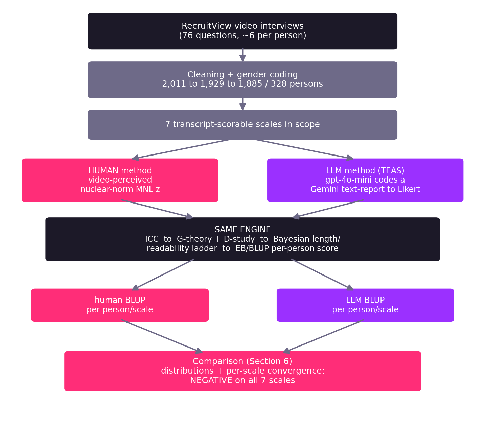
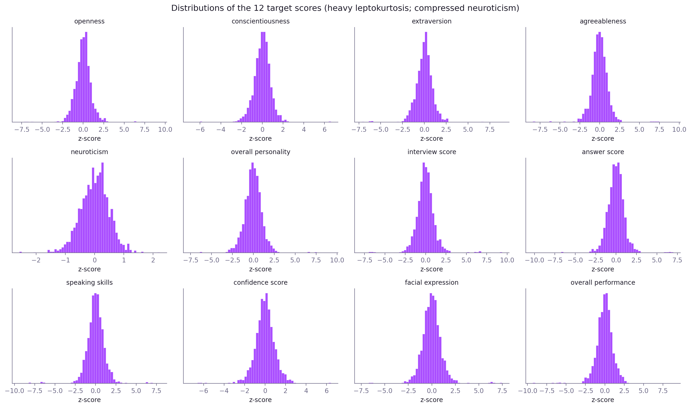
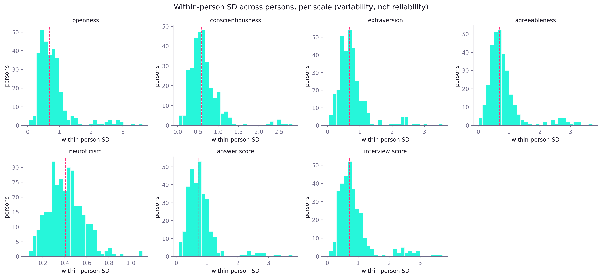
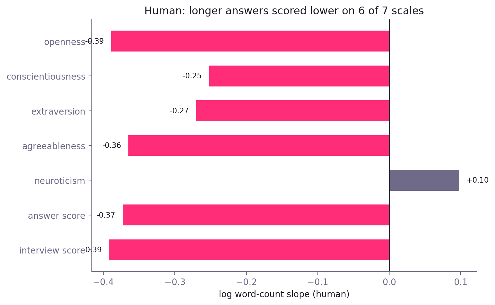
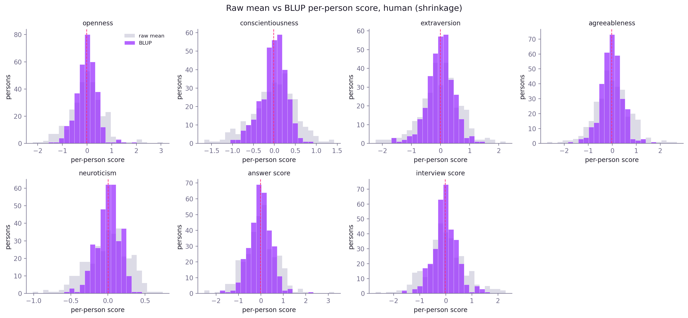
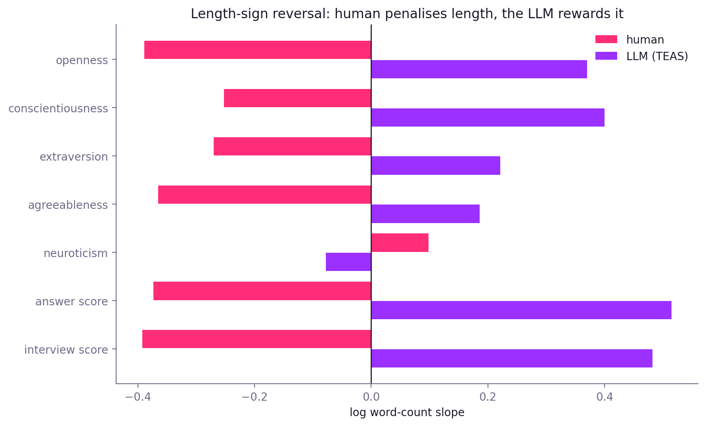
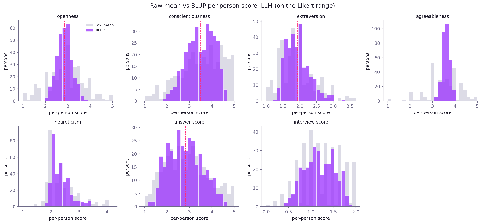
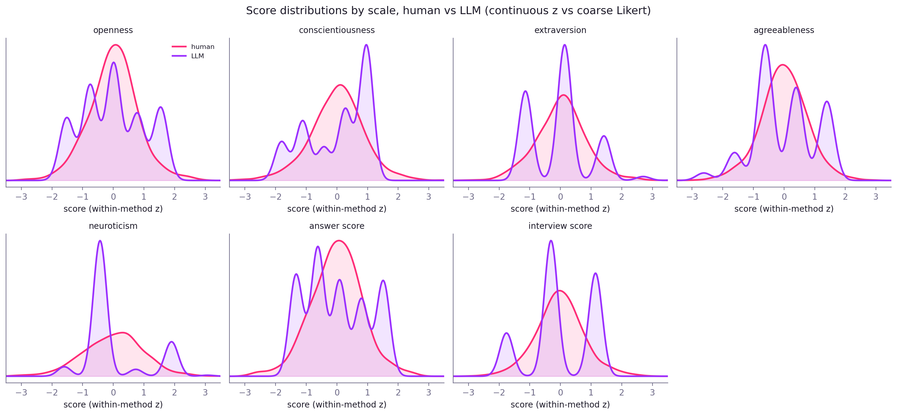

> **Work in progress: under revision.** The numbers and figures are current from the analysis; the wording may still change.

# Does AI interview scoring measure what human raters measure? A psychometric audit of human and LLM scores on 76-question video interviews

## Abstract

AI-assisted interview scoring is being deployed in hiring, yet whether such scores are reliable, and whether they measure the same thing human raters do, is largely untested for this class of system. We treat human ratings and an LLM-based scoring pipeline as two measurement *methods* applied to the same RecruitView video interviews (1,885 responses, 328 candidates, 76 questions after cleaning), and we pass both through the same psychometric engine: one-way ICC, generalizability theory with a D-study (GeneralizIT), a Bayesian response-length and readability ladder (bambi), and an empirical-Bayes (BLUP) per-person aggregation. The human scores are pairwise-derived, video-perceived within-question z-scores; the LLM scores are a content-analysis coding, by OpenAI `gpt-4o-mini`, of each pre-existing Gemini video-report into a Likert value (this audits a deployed system's report, not a scorer we built). Under a single fixed rule (n = 6 questions: trust if VPC_person >= .50, else marginal if E-rho-squared(6) >= .70, else do-not-trust), no human scale reaches trust (VPC_person .18 to .28) and no LLM scale reaches trust either (best case answer_score, marginal). Both methods are dominated by response length: adjusting for log word-count removes a large share of between-person variance on each side (typically 35 to 55%, though less for neuroticism and for LLM extraversion). The direction is reversed: humans score longer answers *lower* (length slope -0.25 to -0.39), the LLM scores them *higher* (length slope +0.19 to +0.52), and gender is scored in opposite directions too (human male-higher, LLM male-lower). Because the two methods load the same length axis with opposite sign, their per-person summary scores correlate negatively on all seven scales (Pearson r -0.23 to -0.63, mean -0.43, all p < .001; n 306 to 328). We read this as convergent (in)validity between two fallible methods, not as one method being correct: an internally coherent LLM scorer can still rank candidates opposite to human raters while both track a construct-irrelevant feature (answer length). All causal and fairness claims are held to "differential rating" because the data carry no rater identifiers, and openness and agreeableness carry a non-random-missingness caveat throughout (36% and 44% LLM abstention).

**Keywords:** psychometrics; generalizability theory; LLM evaluation; interview scoring; reliability; convergent validity; algorithmic hiring; response length.

---

## 1. Introduction

### 1.1 Problem and stakes

Automated and AI-assisted scoring of asynchronous video interviews is now a live part of hiring pipelines. A vendor typically reports that its scores agree with human raters and treats that agreement as evidence the system works. Two questions sit underneath that claim and are rarely answered together for a single system: is the score *reliable* (does a candidate's score reflect a stable property of the candidate rather than which questions they happened to answer), and does it measure the *same construct* a human rater measures. Prior work on automatic interview scoring has examined how training-sample size and NLP method shape such scores (Hickman et al., 2024), but the reliability and cross-method comparability of a deployed LLM pipeline remain under-examined. This report answers both questions for one such pipeline, and does so as an independent audit rather than a vendor validation.

### 1.2 Two methods, one engine, MTMM logic

We treat the human ratings and the LLM scores as two measurement methods of the same interviews, in the multitrait-multimethod tradition. Neither method is a criterion for the other. We never ask whether the LLM is "accurate" or "correct" against the human score as ground truth, because the human score is itself a fallible, model-derived quantity (Section 2.2). What we can ask is convergent validity: do the two methods rank the same candidates the same way. When we report a correlation between the methods, its sign and size are descriptive of their relationship, not a verdict on either one's truth.

**Figure 1. Research flow: one dataset, two scoring methods, one shared engine, one comparison.**

### 1.3 The system under audit and author stance

The LLM score is not a model we built. RecruitView already contains, per answer, a Gemini video-report: a natural-language assessment Gemini produced after watching the recorded answer. Our LLM number is an independent content-analysis coding of that report: OpenAI `gpt-4o-mini` reads the report and converts its stated verdict into a number on each scale. The method is labelled TEAS (Transparent, Evidence-Anchored Scoring). The coder does not re-watch or re-assess the candidate; it codes a given report. This report therefore evaluates the output of a deployed system, and its scope is the reliability and comparability of that output, not the design of a scorer.

---

## 2. Data and methods

### 2.1 Dataset and video-interview design

The data are from RecruitView: asynchronous video interviews in which each candidate answers a small, randomly assigned subset of a 76-question bank. The raw release holds 2,011 answered responses from 331 candidates. Because each person answers only a handful of questions and questions are shared across people, the design is a person-by-question structure that is the natural object of a generalizability analysis (Section 2.9).

**Table 1. Dataset at a glance (after cleaning, Section 2.4).**

| Quantity | Value |
|---|---|
| Responses | 1,885 |
| Candidates (persons) | 328 |
| Questions | 76 |
| Median questions per person | 6 |
| Mean questions per person | 5.75 |
| Range questions per person | 1 to 13 |

### 2.2 Score provenance and distributional quirks

The 12 human target scores in RecruitView are not absolute ratings. They are within-question z-scores produced by the dataset authors from a nuclear-norm multinomial-logit model over pairwise comparisons of answers. Two consequences follow and are carried as caveats throughout the report. First, every human reliability estimate below is the reliability of a *model-derived* quantity, not of an observed human rating. Second, the scores are heavily leptokurtic: excess kurtosis runs from about 9 to 14 on most scales, with extreme tails near plus or minus 8 to 10 that are artifacts of the nuclear-norm reconstruction, which motivates the robust and Bayesian handling used later. Neuroticism is a separate special case: its variance is compressed (SD about 0.49 against about 1.1 elsewhere) and its kurtosis is near-normal, so it behaves unlike the other scales.

**Table 2. Descriptives of all 12 human target scores (analysis sample, n = 1,885).** The seven carried forward (Section 2.6) are marked; interview_score is the decision outcome.

| Target | Mean | SD | Skew | Kurtosis | Min | Max | Scope |
|---|---|---|---|---|---|---|---|
| openness | -0.024 | 1.108 | -0.15 | 13.04 | -7.80 | 9.34 | carried |
| conscientiousness | -0.023 | 0.877 | -0.56 | 11.38 | -6.93 | 6.62 | carried |
| extraversion | -0.023 | 1.074 | -0.56 | 12.04 | -7.18 | 8.91 | carried |
| agreeableness | -0.035 | 1.179 | 0.18 | 13.92 | -8.41 | 9.24 | carried |
| neuroticism | 0.003 | 0.493 | -0.25 | 1.10 | -2.58 | 2.23 | carried (compressed) |
| answer_score | -0.034 | 1.113 | 0.01 | 11.29 | -10.20 | 7.00 | carried |
| interview_score | -0.035 | 1.206 | 0.52 | 11.90 | -7.86 | 9.39 | carried (decision outcome) |
| overall_personality | -0.036 | 1.189 | 0.35 | 10.77 | -7.53 | 9.27 | dropped |
| speaking_skills | -0.023 | 1.267 | -1.08 | 13.08 | -9.41 | 7.90 | dropped |
| confidence_score | -0.028 | 1.063 | -0.73 | 8.62 | -7.29 | 6.42 | dropped |
| facial_expression | -0.027 | 1.122 | 0.29 | 10.21 | -7.46 | 7.47 | dropped |
| overall_performance | -0.038 | 1.179 | -1.09 | 11.78 | -9.31 | 8.85 | dropped |

**Figure 2. Distributions of the 12 target scores.**

### 2.3 Gender coding

Gender is not present in the RecruitView release. It was coded manually per participant (0 = female, 1 = male) and propagated to that participant's responses. All 331 participants are labelled. In the analysis sample the split is 249 male and 79 female persons. Because the female group is under 100 people, all gender contrasts inherit a small-sample caution, and gender is treated as a secondary result throughout (Section 7.3).

### 2.4 Cleaning to the analysis sample

Two kinds of response are removed before analysis. Retakes, where the same candidate re-recorded the same question, are dropped keeping the latest recording (the `dup_keep` flag), removing 82 responses. Answers of five tokens or fewer are dropped as genuine no-content answers with nothing to score, removing a further 44. Three candidates disappear entirely in the process.

**Table 3. Cleaning ladder.**

| Step | Responses | Persons | Removed | Reason |
|---|---|---|---|---|
| Raw release | 2,011 | 331 | - | - |
| After removing retakes | 1,929 | 331 | 82 | same candidate re-recorded the same question |
| After removing no-content answers | 1,885 | 328 | 44 | answer <= 5 tokens |

Every downstream count traces to this final analysis sample of 1,885 responses, 328 persons, 76 questions.

### 2.5 Sample composition and coverage

Candidates answer a median of 6 questions each (mean 5.75, range 1 to 13), which anchors the D-study at a fixed n = 6 (Section 2.9). The person-level gender split is 249 male and 79 female. The female count under 100 is the reason gender contrasts are reported cautiously and never headlined.

**Table 4. Composition of the analysis sample.**

| Quantity | Value |
|---|---|
| Persons, male | 249 |
| Persons, female | 79 |
| Questions per person, median | 6 |
| Questions per person, mean (range) | 5.75 (1 to 13) |

### 2.6 Score structure and scope decision

The seven scales share a strong general (halo) factor. Among the six positively-keyed scales the response-level correlations run from about 0.47 to 0.74, and the two performance-facing scales, answer_score and interview_score, correlate 0.71. Neuroticism is the lone reverse-keyed scale, correlating -0.15 to -0.32 with the others. A single delivery-driven dimension runs through the block rather than seven cleanly separated traits.

**Table 5. Response-level correlation matrix of the seven carried scales (n = 1,885).** Mean off-diagonal correlation 0.36.

| | O | C | E | A | N | ans | int |
|---|---|---|---|---|---|---|---|
| openness | 1.00 | 0.56 | 0.74 | 0.53 | -0.15 | 0.62 | 0.68 |
| conscientiousness | 0.56 | 1.00 | 0.47 | 0.58 | -0.27 | 0.66 | 0.51 |
| extraversion | 0.74 | 0.47 | 1.00 | 0.53 | -0.20 | 0.61 | 0.62 |
| agreeableness | 0.53 | 0.58 | 0.53 | 1.00 | -0.32 | 0.66 | 0.61 |
| neuroticism | -0.15 | -0.27 | -0.20 | -0.32 | 1.00 | -0.32 | -0.23 |
| answer_score | 0.62 | 0.66 | 0.61 | 0.66 | -0.32 | 1.00 | 0.71 |
| interview_score | 0.68 | 0.51 | 0.62 | 0.61 | -0.23 | 0.71 | 1.00 |

We carry forward the seven scales that can in principle be scored from the transcript or its report alone: the Big Five (openness, conscientiousness, extraversion, agreeableness, neuroticism), answer_score, and interview_score. The five scales tied to non-verbal delivery (overall_personality, speaking_skills, confidence_score, facial_expression, overall_performance) are dropped because they have no transcript-side counterpart for the LLM method. Throughout, interview_score is treated separately as a coarse three-level decision outcome (hire vote, 0 to 2), not as a trait or quality scale.

### 2.7 Question structure and Opportunity To Express (OTE)

The 76 prompts are not 76 independent, trait-targeted items. Using MiniLM sentence embeddings and cosine similarity, 16 of the 76 questions have a near-paraphrase elsewhere in the bank (nearest-neighbour cosine >= 0.70; the median nearest-neighbour similarity is 0.60). The closest pair is "What are your greatest strengths and weaknesses?" and "What are your weaknesses?" (0.83); other near-duplicates include two "handle a difficult project" prompts (0.77) and two "resolve a conflict with a coworker" prompts (0.72). Question 1, "Introduce yourself", is a generic opener.

We also estimate, for each question, an Opportunity To Express score per Big Five trait: the cosine between the question and NEO-PI-R facet descriptors for that trait. A low OTE means the question sits outside the trait's semantic field, so scoring that trait from such an answer rests on thin ground (it does not mean a candidate could not express the trait). OTE is modest across the bank: the mean best-matching-trait OTE is 0.26, and 30 of the 76 questions clear no trait's high-OTE threshold at all. When a question does lean toward a trait, it most often leans toward conscientiousness (27 questions) or openness (18).

**Table 6. Example near-paraphrase question pairs (MiniLM cosine).**

| Question A | Question B | Cosine |
|---|---|---|
| What are your greatest strengths and weaknesses? | What are your weaknesses? | 0.83 |
| Tell me about a time you experienced difficulty on a project, how did you handle it? | Tell me about a time you worked on a project outside your comfort zone, how did you handle it? | 0.77 |
| What is your dream company like? | What is your dream job like? | 0.76 |
| What motivates you to perform at your best in the workplace? | What motivates you? | 0.72 |

### 2.8 Response metrics: length, text-richness, and style

Every response is described by a set of transcript-derived metrics, which serve as covariates for the Bayesian ladders in Sections 3.3 and 5.5. They fall into four families. The **length family** counts tokens, types, characters, and sentences; the primary length covariate below is the natural log of word-count. In the analysis sample the median answer is 60 tokens (mean 70, range 6 to 219). **Lexical diversity and complexity** covers type-token ratio, MTLD, MATTR, lexical density, mean sentence length, clauses per sentence, syntactic-tree depth, and subordination. A content-free **style block**, in the spirit of Speer et al. (2025), covers Flesch-Kincaid readability plus a small LIWC-style function-word subset (first-person singular, articles, prepositions, negations, quantifiers, auxiliaries, conjunctions, and long words). **Delivery duration** (short, medium, long) is a coarse categorical marker of speaking length. In the ladders we use log word-count as the length term and Flesch-Kincaid as the readability term; the fuller metric set is available in the length-confound infrastructure. A per-response answer-to-trait content-relevance cosine was also built but is parked and out of scope here; 

### 2.9 Analysis engine (shared)

Both methods pass through the same four-step pipeline, stated once here so Sections 3 and 5 read as mirrors.

1. **ICC.** A one-way random-intercept model `Score ~ (1 | Person)` per scale, giving ICC = sigma2_person / (sigma2_person + sigma2_residual): the share of a single score's variance that is stable between people before question effects are modelled. ICC is scale-invariant, so the human and LLM ICCs are directly comparable.
2. **Generalizability theory and D-study (GeneralizIT).** A person-by-question decomposition into sigma2_person (stable between-person signal), sigma2_question (how much questions differ in difficulty), and sigma2_residual (within-person noise). From these we report VPC_person (the between-person share of a single score), two reliabilities at a fixed n = 6 questions, and the D-study question counts needed to reach relative reliability of .70 and .80.
3. **Bayesian length and readability ladder (bambi/PyMC).** Three nested models per scale: gender only (m1), then plus log word-count (wc), then plus Flesch-Kincaid (ms). This shows how much between-person variance and how much of the gender coefficient survive once length enters, and the sign of the length slope.
4. **Empirical-Bayes (BLUP) aggregation.** Each person's roughly six per-question scores are collapsed to one universe score per scale by shrinking toward the grand mean in proportion to reliability, rather than by a raw mean.

Two reliabilities recur and must be kept distinct. **E-rho-squared (relative)** is the reliability of the *ranking* of people; it treats question difficulty as part of the universe. **Phi (absolute)** is the reliability of a score against a *fixed threshold*; it counts question difficulty as error, so Phi is always at most E-rho-squared. The distinction matters because candidates answer different questions: for ranking, question difficulty can wash out, but for an absolute pass/fail bar it does not.

**Classification rule (fixed n = 6, applied identically to both methods):** a scale is *trust* if VPC_person >= .50; else *marginal* if E-rho-squared(6) >= .70; else *do-not-trust*.

---

## 3. Reliability of the human ratings

### 3.1 Within-person consistency (ICC and within-person SD)

Only about a fifth to a quarter of a single human rating's variance is stable between people. Per-scale ICCs run from 0.18 (neuroticism) to 0.29 (extraversion, answer_score). The complement is within-person movement: across a person's roughly six answers, the ratings swing widely. The median within-person SD is roughly 0.6 to 0.7 on the wider z-scaled scales, which is variability, not reliability, but it is what motivates the formal decomposition that follows.

**Table 7. Human within-person consistency: ICC and within-person SD spread.**

| Scale | ICC | Mean within-person SD | Median | IQR |
|---|---|---|---|---|
| openness | 0.236 | 0.798 | 0.689 | 0.448 |
| conscientiousness | 0.208 | 0.658 | 0.583 | 0.346 |
| extraversion | 0.268 | 0.763 | 0.676 | 0.388 |
| agreeableness | 0.236 | 0.839 | 0.680 | 0.414 |
| neuroticism | 0.183 | 0.413 | 0.404 | 0.210 |
| answer_score | 0.286 | 0.796 | 0.705 | 0.423 |
| interview_score (decision outcome) | 0.241 | 0.867 | 0.723 | 0.475 |

**Figure 4. Distribution of within-person SD across persons, per scale.**

### 3.2 Generalizability theory and D-study

No human scale reaches trust. VPC_person, the between-person share of a single rating, runs from 0.18 to 0.28; even answer_score, the strongest, sits at 0.28 with E-rho-squared(6) = 0.70, at the marginal boundary but classified do-not-trust under the fixed rule. Because the human scores are z-scored within question, sigma2_question is essentially zero, so Phi equals E-rho-squared here: for the human method the ranking and absolute-threshold reliabilities coincide. The D-study implies substantially more questions: reaching a relative reliability of .70 would take roughly 6 questions for answer_score but 7 to 11 for the Big Five and about 8 for the decision outcome, and reaching .80 would take 10 to 19 questions.

**Table 8. Human G-study: variance components, reliabilities at n = 6, D-study, classification.** sigma2_question approximately 0 for all scales, so Phi(6) = E-rho-squared(6).

| Scale | sigma2_person | sigma2_resid | VPC_person | E-rho-sq(6) | Phi(6) | n for .70 | n for .80 | Class |
|---|---|---|---|---|---|---|---|---|
| openness | 0.289 | 0.983 | 0.227 | 0.638 | 0.638 | 7.9 | 13.6 | do-not-trust |
| conscientiousness | 0.159 | 0.639 | 0.199 | 0.599 | 0.599 | 9.4 | 16.1 | do-not-trust |
| extraversion | 0.309 | 0.887 | 0.258 | 0.676 | 0.676 | 6.7 | 11.5 | do-not-trust |
| agreeableness | 0.328 | 1.113 | 0.227 | 0.638 | 0.638 | 7.9 | 13.6 | do-not-trust |
| neuroticism | 0.044 | 0.208 | 0.175 | 0.560 | 0.560 | 11.0 | 18.9 | do-not-trust |
| answer_score | 0.354 | 0.923 | 0.277 | 0.697 | 0.697 | 6.1 | 10.4 | do-not-trust |
| interview_score (decision outcome) | 0.350 | 1.157 | 0.232 | 0.645 | 0.645 | 7.7 | 13.2 | do-not-trust |

### 3.3 What is the signal? Length and readability ladder (Bayesian)

Much of what looks like reliable between-person signal is length signal. Adding log word-count to the model removes a substantial share of the person variance on every scale: about 56% for openness, 52% for answer_score, 54% for interview_score, 44% for conscientiousness, 47% for agreeableness, 34% for extraversion, and only 23% for the compressed neuroticism scale, so roughly 35 to 55% for the scales with real spread. The length slope is negative everywhere except neuroticism, from about -0.25 to -0.39 on the log word-count scale: longer answers received *lower* human ratings. Readability adds essentially nothing beyond length; the Flesch-Kincaid slope is within noise of zero on every scale (its credible interval spans zero). The gender coefficient, positive (male-higher) before adjustment, attenuates by roughly 15 to 26% once length enters, so part but not most of the male-higher pattern travels with answer length.

**Table 9. Human length and readability ladder (Bayesian).** person_before and person_after are sigma2_person before and after adding log word-count; length_b is the log word-count slope; FK_b is the Flesch-Kincaid slope; gender_before and gender_after are the gender (male minus female) coefficient; atten% is the attenuation of the gender coefficient after length.

| Scale | person_before | person_after | %drop | length_b | FK_b | gender_before | gender_after | atten% |
|---|---|---|---|---|---|---|---|---|
| openness | 0.285 | 0.125 | 56 | -0.389 | -0.001 | 0.284 | 0.222 | 22.1 |
| conscientiousness | 0.160 | 0.090 | 44 | -0.252 | 0.015 | 0.161 | 0.122 | 23.9 |
| extraversion | 0.304 | 0.202 | 34 | -0.270 | -0.011 | 0.287 | 0.244 | 14.9 |
| agreeableness | 0.319 | 0.168 | 47 | -0.365 | -0.012 | 0.335 | 0.282 | 15.6 |
| neuroticism | 0.047 | 0.036 | 23 | 0.098 | -0.000 | -0.018 | -0.005 | n/a |
| answer_score | 0.353 | 0.170 | 52 | -0.373 | -0.004 | 0.285 | 0.225 | 21.2 |
| interview_score (decision outcome) | 0.338 | 0.156 | 54 | -0.392 | -0.003 | 0.371 | 0.307 | 17.0 |

**Figure 5. Length slope per scale (human).**

---

## 4. From per-question scores to per-person scores: aggregation and its reliability (human)

### 4.1 EB/BLUP universe score

To place a candidate against the LLM later, we need one human number per person per scale. We do not use the raw mean of their roughly six scores. Instead we use the empirical-Bayes (BLUP) universe score, which shrinks each person toward the grand mean in proportion to how reliably their answers pin them down: a person with few or noisy answers is pulled harder toward zero. This is the person-level object Section 6 correlates against the LLM.

### 4.2 Reliability of the transformation

Shrinkage tracks unreliability directly. The spread of person means shrinks by 31 to 44% depending on the scale, and the more a scale is distrusted (lower reliability) the more it shrinks: neuroticism (43.5%) and conscientiousness (40.6%) shrink most, answer_score (31.3%) least. Shrinkage rescales but does not reorder: the BLUP scores correlate 0.99 with the raw means on every scale, so the ranking of candidates is preserved.

**Table 10. Human BLUP transformation (n = 328 persons).**

| Scale | sd_raw | sd_blup | shrink% | corr_blup_raw |
|---|---|---|---|---|
| openness | 0.679 | 0.430 | 36.6 | 0.990 |
| conscientiousness | 0.519 | 0.309 | 40.6 | 0.988 |
| extraversion | 0.681 | 0.457 | 32.9 | 0.991 |
| agreeableness | 0.725 | 0.459 | 36.7 | 0.991 |
| neuroticism | 0.282 | 0.159 | 43.5 | 0.990 |
| answer_score | 0.724 | 0.497 | 31.3 | 0.992 |
| interview_score (decision outcome) | 0.747 | 0.474 | 36.5 | 0.989 |

**Figure 6. Raw versus BLUP distribution per scale (human).**

---

## 5. Auditing the LLM (TEAS) scores: method and reliability

This section deliberately mirrors Sections 3 and 4 step for step, so that any human versus LLM difference is a property of the method, not of the analysis.

### 5.1 TEAS coding method

OpenAI `gpt-4o-mini` reads each pre-existing Gemini video-report and codes it into a Likert value per scale: the Big Five and answer_score on a 1 to 5 scale, interview_score on a 0 to 2 hire-vote scale, and `null` when the report does not support a rating (an abstention). The coder codes a given report; it does not re-watch or re-assess the candidate. As with the human scores, these are model-derived numbers, and every LLM reliability estimate below is the reliability of that coding, not of a fresh human judgement.

### 5.2 Coverage and abstention (MNAR)

Abstention rates vary sharply by scale, and the missingness is not random: the coder abstains exactly when the Gemini report says little about a trait. Two scales cross the 25% flag and are marked **provisional / do-not-headline**: openness (36.2% abstention) and agreeableness (43.8%). These two carry the provisional caveat every time they appear below. The remaining scales are well covered (conscientiousness 8.2%, extraversion 9.9%, neuroticism 1.4%, answer_score 0.1%, interview_score 0%). Abstentions are listwise-dropped per scale, which is why the effective n differs across scales in the tables that follow.

**Table 11. LLM coverage and abstention.**

| Scale | n scored | Abstention % | Provisional |
|---|---|---|---|
| openness | 1,202 | 36.2 | yes |
| conscientiousness | 1,730 | 8.2 | no |
| extraversion | 1,698 | 9.9 | no |
| agreeableness | 1,059 | 43.8 | yes |
| neuroticism | 1,858 | 1.4 | no |
| answer_score | 1,884 | 0.1 | no |
| interview_score (decision outcome) | 1,885 | 0.0 | no |

### 5.3 Within-person consistency (ICC, LLM)

The same one-way ICC on the TEAS scores is directly comparable to the human ICC in Section 3.1. The picture is similar in magnitude and uneven across scales: LLM ICCs run from 0.14 (agreeableness, provisional) to 0.36 (answer_score). On the well-covered scales the LLM is a little more consistent than the human method for answer_score, interview_score, conscientiousness, and extraversion, and a little less consistent for openness and agreeableness, though the last two are provisional because of abstention.

**Table 12. LLM ICC alongside the human ICC.**

| Scale | LLM ICC | Human ICC | LLM n scored |
|---|---|---|---|
| openness (provisional) | 0.141 | 0.236 | 1,202 |
| conscientiousness | 0.272 | 0.208 | 1,730 |
| extraversion | 0.295 | 0.268 | 1,698 |
| agreeableness (provisional) | 0.137 | 0.236 | 1,059 |
| neuroticism | 0.232 | 0.183 | 1,858 |
| answer_score | 0.361 | 0.286 | 1,884 |
| interview_score (decision outcome) | 0.320 | 0.241 | 1,885 |

### 5.4 Generalizability theory and D-study (LLM); Phi below E-rho-squared

Under the same fixed rule, no LLM scale reaches trust: the highest VPC_person is answer_score at 0.43, below the .50 threshold. Four scales reach marginal (E-rho-squared(6) >= .70): conscientiousness (0.73), extraversion (0.72), answer_score (0.82), and the decision outcome interview_score (0.78). Openness, agreeableness, and neuroticism are do-not-trust; openness and agreeableness are also provisional. The key structural difference from the human side is that the LLM uses raw Likert scores, not within-question z-scores, so sigma2_question is non-zero and Phi drops below E-rho-squared on every scale. For example, answer_score has E-rho-squared(6) = 0.82 but Phi(6) = 0.77, and conscientiousness 0.73 versus 0.69. This gap is the LLM-specific reliability caveat: even its ranking-adequate scales are weaker for an absolute pass/fail bar, a comparability problem precisely because candidates answer different questions.

**Table 13. LLM G-study: variance components (raw Likert), reliabilities at n = 6, D-study, classification.**

| Scale | sigma2_person | sigma2_question | sigma2_resid | VPC_person | E-rho-sq(6) | Phi(6) | n for .70 | Class |
|---|---|---|---|---|---|---|---|---|
| openness (provisional) | 0.245 | 0.218 | 1.242 | 0.165 | 0.542 | 0.501 | 11.8 | do-not-trust |
| conscientiousness | 0.572 | 0.229 | 1.288 | 0.307 | 0.727 | 0.693 | 5.3 | marginal |
| extraversion | 0.181 | 0.018 | 0.413 | 0.304 | 0.724 | 0.716 | 5.3 | marginal |
| agreeableness (provisional) | 0.139 | 0.112 | 0.745 | 0.157 | 0.527 | 0.492 | 12.5 | do-not-trust |
| neuroticism | 0.171 | 0.023 | 0.542 | 0.240 | 0.655 | 0.645 | 7.4 | do-not-trust |
| answer_score | 0.723 | 0.298 | 0.968 | 0.428 | 0.818 | 0.774 | 3.1 | marginal |
| interview_score (decision outcome) | 0.153 | 0.060 | 0.262 | 0.369 | 0.778 | 0.740 | 4.0 | marginal |

### 5.5 Length and readability ladder (LLM, Bayesian); the reversal

The same three-rung ladder on the LLM scores gives the mirror image. Adding log word-count again removes a large share of person variance (about 64% openness, 59% answer_score, 58% interview_score, 50% conscientiousness, 40% agreeableness, smaller for extraversion and near-zero for neuroticism), so the LLM is also length-driven. But the length slope is **positive** on every scale except neuroticism, from about +0.19 to +0.52 on the log word-count scale: longer answers received *higher* LLM scores, the reversal of the human penalty. The gender coefficient is also reversed: negative (male-lower) on every scale except neuroticism, where the human method was male-higher. Readability again adds little beyond length. This reversal on the shared length axis is the mechanism behind Section 6's negative convergence.

**Table 14. LLM length and readability ladder (Bayesian).** length_b is the log word-count slope (positive throughout, the reversal of the human penalty); gender_before and gender_after are the gender (male minus female) coefficient.

| Scale | person_before | person_after | %drop | length_b | FK_b | gender_before | gender_after |
|---|---|---|---|---|---|---|---|
| openness (provisional) | 0.154 | 0.056 | 64 | +0.370 | 0.043 | -0.202 | -0.171 |
| conscientiousness | 0.251 | 0.125 | 50 | +0.400 | 0.027 | -0.331 | -0.271 |
| extraversion | 0.288 | 0.238 | 17 | +0.221 | 0.016 | -0.278 | -0.252 |
| agreeableness (provisional) | 0.085 | 0.051 | 40 | +0.186 | 0.002 | -0.321 | -0.308 |
| neuroticism | 0.239 | 0.235 | 2 | -0.078 | -0.029 | 0.128 | 0.119 |
| answer_score | 0.350 | 0.145 | 59 | +0.515 | 0.006 | -0.306 | -0.221 |
| interview_score (decision outcome) | 0.298 | 0.124 | 58 | +0.482 | 0.013 | -0.336 | -0.264 |

**Figure 7. Human versus LLM length slope, side by side.**

### 5.6 BLUP transformation and its reliability (LLM)

The same EB/BLUP aggregation produces the LLM per-person object. Shrinkage is severe exactly where the method is most fragile: agreeableness shrinks 76% and openness 62%, the two provisional MNAR scales, which also carry fewer scored persons (306 and 323 respectively, against 328 elsewhere). At the other end, the well-covered answer_score and interview_score shrink least (24% and 28%). Rank preservation is a little weaker than on the human side, with corr_blup_raw from 0.90 (agreeableness, provisional) to 0.98 (extraversion). These are the LLM per-person scores placed against the human ones in Section 6.

**Table 15. LLM BLUP transformation.**

| Scale | n persons | sd_raw | sd_blup | shrink% | corr_blup_raw |
|---|---|---|---|---|---|
| openness (provisional) | 323 | 0.853 | 0.329 | 61.5 | 0.925 |
| conscientiousness | 325 | 0.977 | 0.610 | 37.6 | 0.958 |
| extraversion | 327 | 0.534 | 0.351 | 34.2 | 0.980 |
| agreeableness (provisional) | 306 | 0.708 | 0.170 | 76.1 | 0.899 |
| neuroticism | 328 | 0.547 | 0.332 | 39.3 | 0.968 |
| answer_score | 327 | 0.992 | 0.751 | 24.4 | 0.967 |
| interview_score (decision outcome) | 328 | 0.464 | 0.333 | 28.2 | 0.967 |

**Figure 8. Raw versus BLUP distribution per scale (LLM), on the Likert range.**

---

## 6. Human versus LLM comparison

### 6.1 Score distributions by scale

Standardised within method (mean 0, SD 1), the two methods' score distributions differ mainly in granularity: the human z-scores are continuous, while the LLM scores are coarse Likert values (1 to 5, and 0 to 2 for the decision outcome), so the LLM curve is visibly discrete. The two objects are comparable in location and spread once standardised, which is what makes the per-scale correlation in 6.2 meaningful.

**Figure 9. Per-scale score distributions, human versus LLM (within-method standardised).**

### 6.2 Convergence per scale (BLUP correlation): the headline

Correlating each method's per-person BLUP summary score gives the convergent-validity diagonal: does a candidate the humans rate high also get scored high by the LLM. The answer is no, on every scale. All seven Pearson correlations are negative, from -0.23 (agreeableness, provisional) to -0.63 (the decision outcome interview_score), with a mean of -0.43; Spearman rho tracks Pearson closely (mean -0.46), so the pattern is not driven by a few extreme scores. Every correlation is significant (all p < .001; n from 306 to 328, fewer where the LLM abstained). The LLM systematically ranks candidates opposite to the human raters. We read this as convergent (in)validity between two fallible methods, and hand the mechanism to the Discussion. Openness and agreeableness remain provisional here because of their non-random LLM abstention.

**Table 16. Human versus LLM convergence of per-person BLUP scores.**

| Scale | n (both scored) | Pearson r | Spearman rho | p |
|---|---|---|---|---|
| openness (provisional) | 323 | -0.376 | -0.413 | < .001 |
| conscientiousness | 325 | -0.486 | -0.505 | < .001 |
| extraversion | 327 | -0.425 | -0.459 | < .001 |
| agreeableness (provisional) | 306 | -0.226 | -0.261 | < .001 |
| neuroticism | 328 | -0.281 | -0.292 | < .001 |
| answer_score | 327 | -0.605 | -0.611 | < .001 |
| interview_score (decision outcome) | 328 | -0.632 | -0.656 | < .001 |
| **Mean** | | **-0.433** | **-0.457** | |

The full 7-by-7 multitrait-multimethod matrix (convergent diagonal versus discriminant off-diagonal) is deliberately out of scope for this report and is left as future work.

---

## 7. Discussion

### 7.1 One shared axis, opposite signs

The negative convergence is not two methods disagreeing about a construct after each has measured it well. Both methods are dominated by the same feature, response length, which absorbs roughly 35 to 55% of between-person variance on each side (less for neuroticism and for LLM extraversion). Length is construct-irrelevant for the personality traits; for answer quality its relevance is more arguable, since a longer answer can be genuinely more complete. The human method penalises length (longer answers score lower) and the LLM method rewards it (longer answers score higher). When two summary scores load a common axis with opposite sign, and that axis dominates their variance, they will tend to correlate negatively, which is what Section 6.2 shows. The disagreement is therefore best read as a length-sign artifact of two length-driven methods, not as independent evidence about who is the better candidate. Readability and, in the parked analysis, answer content add little beyond length, so controlling for length would not be expected to turn the convergence positive (an expectation, not directly tested in this report); it would mostly remove the shared axis that produces the sign flip.

### 7.2 Neither method is trustworthy

Under one common, fixed rule, no scale reaches trust for either method. The human scores top out at VPC_person 0.28 (answer_score) and the LLM at 0.43 (answer_score), both below the .50 bar, and the marginal-reliability D-studies imply needing roughly 6 to 12 questions per person to reach even a .70 ranking reliability. The practical reading is that a large part of what either method calls a person's "trait level" is delivery and length signal, so neither score should be used as a stand-alone measure of a candidate.

### 7.3 Gender is scored in opposite directions

Gender is a secondary result here and is reported with a small-sample caution: the analysis sample has 79 female and 249 male persons, below the usual 100-per-group floor. With that caveat, the two methods score gender in opposite directions. The human method assigns higher scores to men on the positively-keyed scales (gender coefficient about +0.16 to +0.37, attenuating 15 to 26% after length), while the LLM assigns lower scores to men (about -0.20 to -0.34), with neuroticism the exception in both directions. Because the data carry no rater identifiers and the scores are model-derived, this is a **differential rating** by method, not an identified biasing mechanism: we can say the two methods rate the genders differently and in opposite directions, but not that either is biased in a causally-identified sense. Part of the human male-higher pattern travels with answer length; the LLM's male-lower pattern is consistent with its length reward, since the length and gender effects point the same way within each method.

### 7.4 Comparability for decisions (E-rho-squared versus Phi)

For the LLM, Phi sits below E-rho-squared on every scale because raw Likert scoring lets question difficulty enter as error. In hiring terms, even the LLM scales that rank people acceptably (answer_score, conscientiousness, extraversion, and the interview_score decision outcome reach marginal ranking reliability) are weaker for an absolute pass/fail threshold applied across candidates who answered different questions. The human z-scores hide this problem by construction (within-question standardisation forces sigma2_question to zero), which is a modelling choice, not evidence that question difficulty is absent.

### 7.5 Implications for AI-assisted hiring

The audit's general lesson is that internal coherence is not validity. The LLM pipeline is internally coherent (its ICCs and marginal G-coefficients are in the same range as, and on some scales above, the human method), yet it measures something anti-correlated with human judgement and, like the human method, substantially driven by a construct-irrelevant feature. A vendor claim that an LLM scorer "agrees with human raters" is not even weakly supported here, and the reason (a shared length axis weighted oppositely) is the kind of failure that a headline agreement statistic on a single scale can easily hide. Treating LLM interview scores as a drop-in for human judgement is not warranted on this evidence.

---

## 8. Limitations

- **No rater identifiers.** The gender and length effects are method-level differential rating, not identified bias. This qualifies Sections 3.3, 5.5, and 7.3.
- **Non-random abstention (MNAR).** The LLM abstains where the Gemini report is thin, so openness (36%) and agreeableness (44%) are provisional and were flagged everywhere they appear (Sections 5.2, 5.4, 5.6, 6.2).
- **Model-derived scores on both sides.** The human scores are nuclear-norm MNL z-scores, not observed ratings; the LLM scores code a Gemini report, not a fresh assessment. Every reliability figure is the reliability of a model-derived quantity.
- **interview_score is a coarse ordinal.** The decision outcome has three levels (0 to 2) and limited variance; it is reported separately and read cautiously.
- **Small female group.** With 79 female persons (under 100), all gender contrasts carry a small-sample caution.
- **Single LLM configuration.** One model (`gpt-4o-mini`), one version, one temperature: there is no generalizability across LLM facets in the sense of Speer et al. (2025), so the LLM reliabilities do not account for prompt or model-version variance.

---

## 9. Conclusion

Passing human and LLM interview scores through one common psychometric engine shows that both are substantially length-driven and neither reaches trust on any scale, and that because the two methods weight response length with opposite sign, their per-person summary scores disagree systematically: convergence is negative on all seven scales (mean Pearson -0.43). An LLM scorer can be internally coherent and still rank candidates opposite to human raters while both track a construct-irrelevant feature. This is a caution against treating LLM interview scores as a drop-in for human judgement, and it motivates two next steps: the full multitrait-multimethod matrix deferred here, and a purpose-built scorer designed to measure the construct rather than the length of the answer.

---

## Data availability

The RecruitView dataset (Gupta et al., 2025) is gated and licensed CC BY-NC 4.0 (academic, non-commercial use). It is not redistributed here; access can be requested at https://huggingface.co/datasets/AI4A-lab/RecruitView. This report shares only aggregate tables, never row-level scores.

